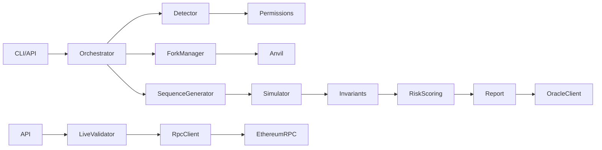

# Architecture

## Modules

- **core static analysis** — executable-opcode risk patterns and canonical IHooks selector assurance.
- **core** — six-chain registry, V4 address-bit permission decoding, deterministic sequence generator, orchestration, oracle ABI helpers.
- **core RPC** — chain-aware JSON-RPC requests with bounded timeouts and transient retries; live validation verifies chain ID, hook bytecode, and PoolManager existence without mutating state.
- **simulator** — Anvil fork planning/lifecycle and bounded deterministic execution.
- **invariants** — conservation, unauthorized transfer, LP integrity, donation integrity, failed fee accounting, exploitative reentrancy, revert consistency, and severity scoring.
- **oracle** — immutable publisher-bound Solidity storage contract.
- **replay** — historical receipt comparison plus real Anvil parent-block transaction simulation.
- **deployment monitor** — resumable multi-chain hook discovery with permission decoding.
- **api** — validated REST interface.
- **cli** — scriptable JSON reporting.

## Determinism

Deterministic analysis uses a seedable PRNG and pure operation model; historical simulation additionally executes real transactions on temporary forks. This makes the generator itself fuzzable, keeps CI independent of RPC availability, and allows exact regression fingerprints. Live RPC/Anvil integration is isolated behind the fork adapter.

## Safety Boundaries

HookGuard never sends production transactions. Analysis is read-only by design; forks are local, temporary processes.

## Explicit Execution Safety Model

Offline analysis plans operations from permissions alone; it does not contact a network or execute V4 state transitions. Explicit fork execution is a separate opt-in boundary with these invariants:

- **Addresses do not define a pool.** A bare hook/pool address cannot be expanded into valid V4 pool metadata. Callers must supply a complete `currency0`, `currency1`, `fee`, `tickSpacing`, and `hooks` PoolKey plus the target PoolManager.
- **Canonicalization precedes execution.** Addresses are normalized and currency ordering is validated; the resulting PoolID appears on each typed outcome so reviewers can verify which exact pool was exercised.
- **Identity must agree.** The PoolKey hook and externally analyzed permission context must decode to the same hook address; mismatched identities are rejected before RPC I/O.
- **All calls are read-only.** Explicit execution sends encoded calls through JSON-RPC `eth_call`. It never requests signatures or broadcasts production transactions.
- **RPC failures stay distinct from reverts.** Typed outcomes retain selector/intent, operation label, PoolID, block evidence, timestamps, raw RPC errors, and revert reasons where available. Malformed envelopes and transport failures therefore cannot be mistaken for a normal contract-level revert merely because both may map to a conservative finding.

## Live Validation Fallback

Live fixture tests require `HOOKGUARD_LIVE_TESTS`; otherwise they remain deterministic offline checks. Without an RPC credential, `/v1/live-validate` returns a deterministic skipped result rather than making network calls.

## Fork Evidence

The Unichain hook \`0x6337fCa822066240064dAff387E61653AEEC90c8\`, initialized by transaction \`0xdbcf08e57659c16e6d6d23b208341a54d2ea7197219772b39903b8e2845e9ff7\`, is covered by a local post-initialization fork harness in \`packages/oracle/test/ForkHookExecution.t.sol\`. The test adds liquidity through canonical V4 settle calls, executes a swap, and proves that the resulting unlock reverts with \`CurrencyNotSettled()\`. The residual is attributable to the hook rather than the caller. This is confirmed execution evidence of an unsafe settlement/accounting lifecycle that blocks the V4 unlock with \`CurrencyNotSettled()\`; it is not evidence of direct token theft.

At block 56,788,267, canonical logs show exactly one pool for this hook: WBTC/USDC (0.30% fee, tick spacing 60, PoolID above). The pool reports zero active liquidity and the hook holds no WBTC or USDC, so there is currently no exposed TVL or demonstrated profit path. The finding should therefore be reported as a correctness/DoS risk in dormant capital, not an active theft vector.
